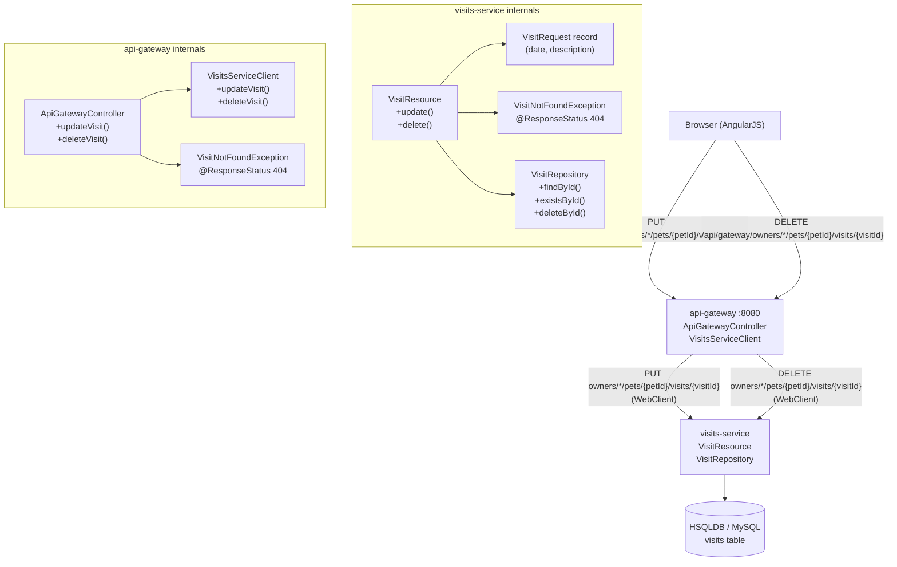
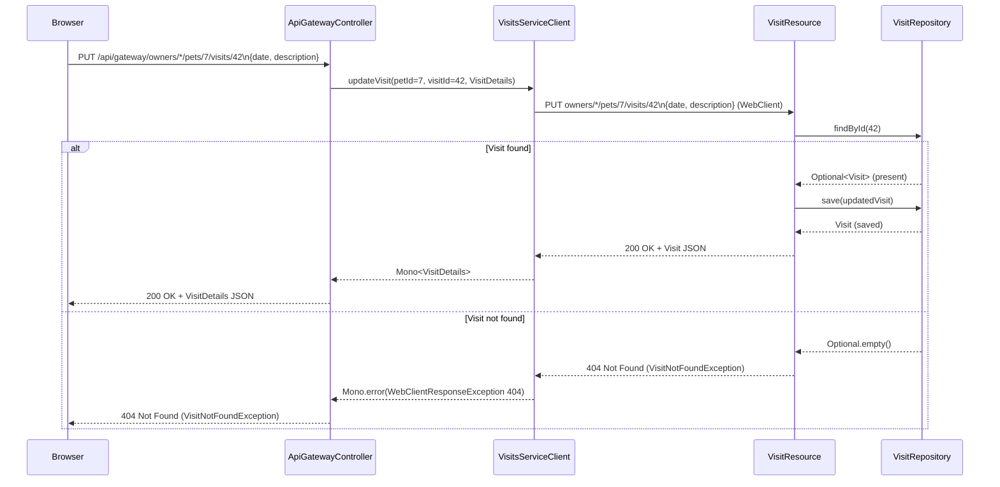
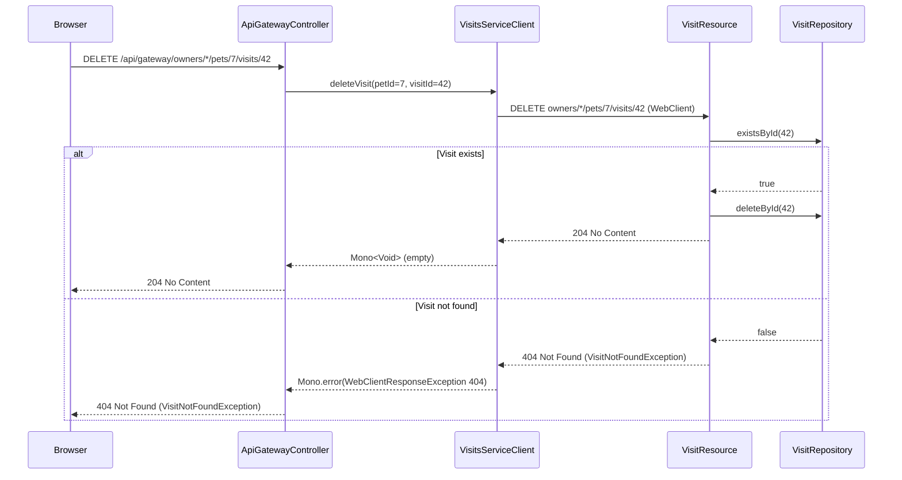
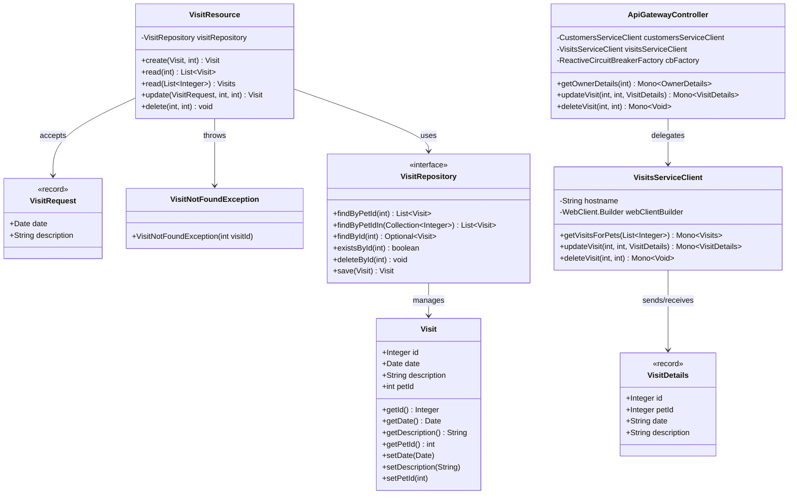
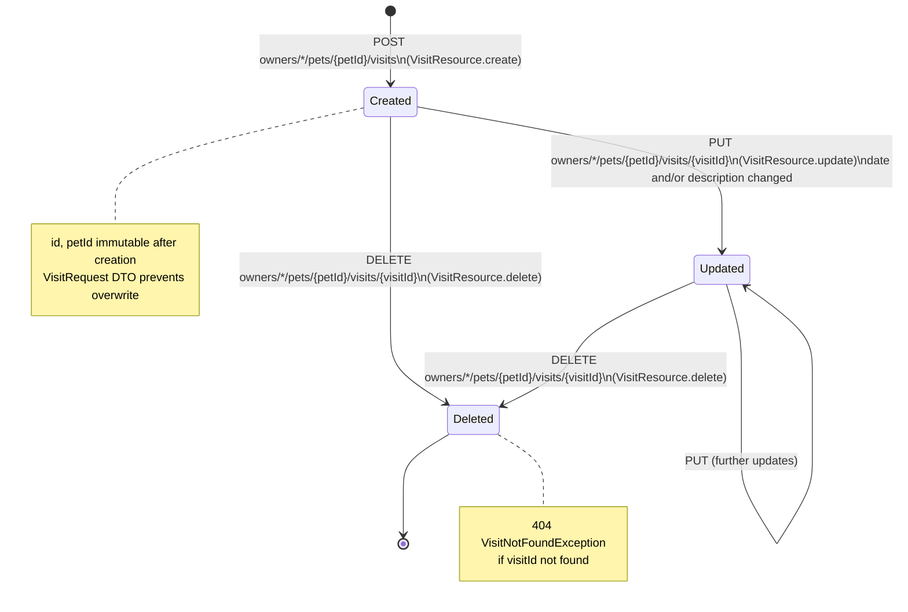

# PRD: Visit Update & Delete Enhancement (PR #149)

This document is a Product Requirements Document (PRD) for the enhancement introduced in
[spring-petclinic-microservices PR #149](https://github.com/spring-petclinic/spring-petclinic-microservices/pull/149).
The PR adds full CRUD support for veterinary visit records by introducing `PUT` (update) and
`DELETE` endpoints across the visits-service and api-gateway, along with a new
`VisitNotFoundException`, a `VisitRequest` DTO, and comprehensive test coverage.

---

## Design & Architecture

### Overview

The Spring PetClinic Microservices application previously supported only **Create** (`POST`) and
**Read** (`GET`) operations on visit records. PR #149 closes the CRUD gap by adding **Update**
(`PUT`) and **Delete** (`DELETE`) capabilities. The change spans two microservices:

1. **visits-service** — the authoritative data owner. New REST endpoints
   `PUT owners/*/pets/{petId}/visits/{visitId}` and `DELETE owners/*/pets/{petId}/visits/{visitId}`
   are added to `VisitResource.java`. A new `VisitRequest` record DTO decouples the update
   payload from the JPA entity (preventing clients from overwriting `id` or `petId`). A new
   `VisitNotFoundException` maps to HTTP 404, consistent with `ResourceNotFoundException` in
   customers-service.

2. **api-gateway** — the public-facing proxy. New `PUT` and `DELETE` endpoints are added to
   `ApiGatewayController.java` that delegate to two new methods (`updateVisit`, `deleteVisit`)
   in `VisitsServiceClient.java` using reactive WebClient. A parallel `VisitNotFoundException`
   is added in the gateway's `boundary.web` package to translate upstream 404 responses into
   proper HTTP 404 replies to the browser.

The AngularJS frontend (`visits.controller.js`) currently only supports create; the PR does
**not** extend the frontend — that is a follow-on concern. All new code follows existing
project conventions: package-private controller classes, `@Timed` Micrometer annotations,
SLF4J logging, `@MockitoBean` in `@WebMvcTest` / `@WebFluxTest` slice tests.

### Diagrams

#### Architecture / Component Diagram



#### Sequence Diagram — Update Visit Flow



#### Sequence Diagram — Delete Visit Flow



#### Class / Data Model Diagram



#### State Machine — Visit Lifecycle



### Directory Structure

```
spring-petclinic-microservices/
├── spring-petclinic-visits-service/
│   └── src/
│       ├── main/java/.../visits/
│       │   ├── model/
│       │   │   ├── Visit.java                    # JPA entity (unchanged)
│       │   │   └── VisitRepository.java          # JPA repo (unchanged — existsById inherited)
│       │   └── web/
│       │       ├── VisitResource.java            # MODIFIED: +update(), +delete(), +VisitRequest record
│       │       └── VisitNotFoundException.java   # NEW: @ResponseStatus(404) exception
│       └── test/java/.../visits/web/
│           └── VisitResourceTest.java            # MODIFIED: +shouldUpdateVisit, +shouldDeleteVisit, +404 tests
│
└── spring-petclinic-api-gateway/
    └── src/
        ├── main/java/.../api/
        │   ├── application/
        │   │   └── VisitsServiceClient.java      # MODIFIED: +updateVisit(), +deleteVisit()
        │   ├── boundary/web/
        │   │   ├── ApiGatewayController.java     # MODIFIED: +updateVisit(), +deleteVisit()
        │   │   └── VisitNotFoundException.java   # NEW: @ResponseStatus(404) exception
        │   └── dto/
        │       └── VisitDetails.java             # UNCHANGED (id, petId, date, description)
        └── test/java/.../api/boundary/web/
            └── ApiGatewayControllerTest.java     # MODIFIED: +updateVisit tests, +deleteVisit tests
```

### Key Design Decisions

| Decision | Choice | Rationale |
|----------|--------|-----------|
| Separate `VisitRequest` DTO for updates | `record VisitRequest(Date date, String description)` | Prevents clients from overwriting immutable fields (`id`, `petId`); mirrors `OwnerRequest`/`PetRequest` pattern in customers-service |
| Partial update semantics | Null-check fields before setting | Allows clients to update only `date` or only `description` without sending both; avoids PATCH complexity |
| `existsById` before `deleteById` | Two-step delete in `VisitResource.delete()` | Enables explicit 404 response when visit not found; `deleteById` on JPA silently no-ops |
| `VisitNotFoundException` in both services | Separate classes in `visits.web` and `api.boundary.web` | Each service owns its own exception hierarchy; gateway translates upstream 404 via `WebClientResponseException` mapping |
| Reactive error mapping in gateway | `onErrorMap(WebClientResponseException, ...)` | Translates HTTP 404 from visits-service into gateway-level `VisitNotFoundException` without breaking reactive pipeline |
| No frontend changes in this PR | AngularJS `visits.controller.js` unchanged | Scope-limited PR; UI edit/delete is a follow-on feature |
| No schema migration needed | `VisitRepository` inherits `existsById`/`deleteById` from `JpaRepository` | No new columns; only new REST endpoints and service logic |
| `@WebMvcTest` for visits-service tests | Slice test with `@MockitoBean VisitRepository` | Consistent with existing `VisitResourceTest` pattern; fast, focused controller tests |
| `@WebFluxTest` for gateway tests | `WebTestClient` with `@MockitoBean` service clients | Consistent with existing `ApiGatewayControllerTest` pattern; tests reactive controller layer |

### Technology Stack

- **Runtime/Language:** Java 17
- **Framework:** Spring Boot 4.0.1, Spring MVC (visits-service), Spring WebFlux (api-gateway)
- **Spring Cloud:** 2025.1.0 — Resilience4j circuit breaker, Eureka discovery
- **Persistence:** Spring Data JPA (`JpaRepository`) — HSQLDB (default), MySQL (optional)
- **Reactive:** Project Reactor (`Mono<T>`) — api-gateway WebClient calls
- **Observability:** Micrometer `@Timed("petclinic.visit")`, SLF4J logging
- **Testing:** JUnit 5, MockMvc (`@WebMvcTest`), WebTestClient (`@WebFluxTest`), Mockito (`@MockitoBean`)
- **Build:** Maven 3.x with Spring Boot Maven Plugin

---

## Execution Plan

### Phase 1: visits-service — VisitNotFoundException
**Estimated effort:** 0.5 hours
**Dependencies:** None

Add the `VisitNotFoundException` class to the visits-service `web` package. This is a prerequisite for the update and delete endpoints in Phase 2.

#### Tasks:
- [ ] Create `spring-petclinic-visits-service/src/main/java/org/springframework/samples/petclinic/visits/web/VisitNotFoundException.java`
  - Annotate with `@ResponseStatus(value = HttpStatus.NOT_FOUND)`
  - Extend `RuntimeException`
  - Constructor: `public VisitNotFoundException(int visitId)` → `super("Visit " + visitId + " not found")`
  - Add Javadoc: consistent with `ResourceNotFoundException` in customers-service

#### Deliverables:
- `VisitNotFoundException.java` in `visits-service/web` package

---

### Phase 2: visits-service — Update & Delete Endpoints in VisitResource
**Estimated effort:** 1.5 hours
**Dependencies:** Phase 1

Extend `VisitResource.java` with `PUT` (update) and `DELETE` (delete) endpoints and the `VisitRequest` inner record DTO.

#### Tasks:
- [ ] Open `spring-petclinic-visits-service/src/main/java/org/springframework/samples/petclinic/visits/web/VisitResource.java`
- [ ] Add imports: `@DeleteMapping`, `@PutMapping`, `@PathVariable`, `Optional` (already present via JPA), `VisitNotFoundException`
- [ ] Add inner `record VisitRequest(Date date, String description)` with Javadoc explaining the DTO pattern
- [ ] Implement `update()` method:
  ```java
  @PutMapping("owners/*/pets/{petId}/visits/{visitId}")
  public Visit update(
      @Valid @RequestBody VisitRequest visitRequest,
      @PathVariable("petId") @Min(1) int petId,
      @PathVariable("visitId") @Min(1) int visitId)
  ```
  - Call `visitRepository.findById(visitId).orElseThrow(() -> new VisitNotFoundException(visitId))`
  - Null-check `visitRequest.date()` before `visit.setDate(...)`
  - Null-check `visitRequest.description()` before `visit.setDescription(...)`
  - Log: `log.info("Updating visit {}", visit)`
  - Return `visitRepository.save(visit)`
- [ ] Implement `delete()` method:
  ```java
  @DeleteMapping("owners/*/pets/{petId}/visits/{visitId}")
  @ResponseStatus(HttpStatus.NO_CONTENT)
  public void delete(
      @PathVariable("petId") @Min(1) int petId,
      @PathVariable("visitId") @Min(1) int visitId)
  ```
  - Call `visitRepository.existsById(visitId)` — throw `VisitNotFoundException(visitId)` if false
  - Log: `log.info("Deleting visit {}", visitId)`
  - Call `visitRepository.deleteById(visitId)`
- [ ] Verify `VisitRepository` interface already extends `JpaRepository<Visit, Integer>` (inherits `findById`, `existsById`, `deleteById` — no changes needed)

#### Deliverables:
- Updated `VisitResource.java` with `update()`, `delete()`, and `VisitRequest` record

---

### Phase 3: api-gateway — VisitNotFoundException
**Estimated effort:** 0.5 hours
**Dependencies:** None

Add the `VisitNotFoundException` class to the api-gateway `boundary.web` package. This is a prerequisite for the gateway controller changes in Phase 4.

#### Tasks:
- [ ] Create `spring-petclinic-api-gateway/src/main/java/org/springframework/samples/petclinic/api/boundary/web/VisitNotFoundException.java`
  - Annotate with `@ResponseStatus(value = HttpStatus.NOT_FOUND)`
  - Extend `RuntimeException`
  - Constructor: `public VisitNotFoundException(int visitId)` → `super("Visit not found with id: " + visitId)`
  - Add Javadoc explaining it translates upstream 404 responses from visits-service

#### Deliverables:
- `VisitNotFoundException.java` in `api-gateway/boundary/web` package

---

### Phase 4: api-gateway — VisitsServiceClient Update & Delete Methods
**Estimated effort:** 1.5 hours
**Dependencies:** Phase 3

Extend `VisitsServiceClient.java` with reactive `updateVisit()` and `deleteVisit()` methods using WebClient.

#### Tasks:
- [ ] Open `spring-petclinic-api-gateway/src/main/java/org/springframework/samples/petclinic/api/application/VisitsServiceClient.java`
- [ ] Add imports: `HttpStatus`, `WebClientResponseException`
- [ ] Implement `updateVisit()` method:
  ```java
  public Mono<VisitDetails> updateVisit(final int petId, final int visitId, final VisitDetails visit)
  ```
  - Use `webClientBuilder.build().put()`
  - URI: `hostname + "owners/*/pets/{petId}/visits/{visitId}"` with `petId`, `visitId` path vars
  - `.bodyValue(visit)`
  - `.retrieve()`
  - `.onStatus(HttpStatus.NOT_FOUND::equals, response -> Mono.error(new WebClientResponseException(404, "Not Found", response.headers().asHttpHeaders(), null, null)))`
  - `.bodyToMono(VisitDetails.class)`
  - Add Javadoc describing parameters and return type
- [ ] Implement `deleteVisit()` method:
  ```java
  public Mono<Void> deleteVisit(final int petId, final int visitId)
  ```
  - Use `webClientBuilder.build().delete()`
  - URI: `hostname + "owners/*/pets/{petId}/visits/{visitId}"` with `petId`, `visitId` path vars
  - `.retrieve()`
  - `.onStatus(HttpStatus.NOT_FOUND::equals, response -> Mono.error(new WebClientResponseException(404, "Not Found", response.headers().asHttpHeaders(), null, null)))`
  - `.bodyToMono(Void.class)`
  - Add Javadoc describing parameters and return type

#### Deliverables:
- Updated `VisitsServiceClient.java` with `updateVisit()` and `deleteVisit()` methods

---

### Phase 5: api-gateway — ApiGatewayController Update & Delete Endpoints
**Estimated effort:** 1.5 hours
**Dependencies:** Phase 3, Phase 4

Extend `ApiGatewayController.java` with `PUT` and `DELETE` endpoints that proxy to `VisitsServiceClient` and translate 404 errors using `VisitNotFoundException`.

#### Tasks:
- [ ] Open `spring-petclinic-api-gateway/src/main/java/org/springframework/samples/petclinic/api/boundary/web/ApiGatewayController.java`
- [ ] Add imports: `@DeleteMapping`, `@PutMapping`, `@RequestBody`, `@ResponseStatus`, `HttpStatus`, `WebClientResponseException`, `VisitNotFoundException`, `VisitDetails`
- [ ] Implement `updateVisit()` endpoint:
  ```java
  @PutMapping("owners/*/pets/{petId}/visits/{visitId}")
  public Mono<VisitDetails> updateVisit(
      @PathVariable("petId") int petId,
      @PathVariable("visitId") int visitId,
      @RequestBody VisitDetails visit)
  ```
  - Delegate to `visitsServiceClient.updateVisit(petId, visitId, visit)`
  - Chain `.onErrorMap(WebClientResponseException.class, ex -> ex.getStatusCode() == HttpStatus.NOT_FOUND ? new VisitNotFoundException(visitId) : ex)`
  - Add Javadoc describing the proxy behavior and 404 mapping
- [ ] Implement `deleteVisit()` endpoint:
  ```java
  @DeleteMapping("owners/*/pets/{petId}/visits/{visitId}")
  @ResponseStatus(HttpStatus.NO_CONTENT)
  public Mono<Void> deleteVisit(
      @PathVariable("petId") int petId,
      @PathVariable("visitId") int visitId)
  ```
  - Delegate to `visitsServiceClient.deleteVisit(petId, visitId)`
  - Chain `.onErrorMap(WebClientResponseException.class, ex -> ex.getStatusCode() == HttpStatus.NOT_FOUND ? new VisitNotFoundException(visitId) : ex)`
  - Add Javadoc describing the proxy behavior and 204/404 responses

#### Deliverables:
- Updated `ApiGatewayController.java` with `updateVisit()` and `deleteVisit()` endpoints

---

### Phase 6: Testing & Quality Assurance
**Estimated effort:** 2.5 hours
**Dependencies:** Phase 1, Phase 2, Phase 3, Phase 4, Phase 5

Write and run all unit tests for the new update and delete functionality in both services.

#### Tasks:
- [ ] **visits-service — VisitResourceTest.java** (`@WebMvcTest(VisitResource.class)`, `@ActiveProfiles("test")`):
  - [ ] Add `shouldUpdateVisit()` test:
    - `given(visitRepository.findById(42)).willReturn(Optional.of(existingVisit))`
    - `given(visitRepository.save(any(Visit.class))).willReturn(updatedVisit)`
    - `mvc.perform(put("/owners/1/pets/7/visits/42").contentType(APPLICATION_JSON).content(requestBody))`
    - Assert `status().isOk()`, `jsonPath("$.id").value(42)`, `jsonPath("$.description").value("Updated description")`
    - `verify(visitRepository).findById(42)` and `verify(visitRepository).save(any(Visit.class))`
  - [ ] Add `shouldReturn404WhenUpdatingNonExistentVisit()` test:
    - `given(visitRepository.findById(999)).willReturn(Optional.empty())`
    - Assert `status().isNotFound()`
    - `verify(visitRepository, never()).save(any(Visit.class))`
  - [ ] Add `shouldReturn404WhenPetIdMismatchOnUpdate()` test (documents actual behavior — no petId ownership check):
    - `given(visitRepository.findById(55)).willReturn(Optional.empty())`
    - Assert `status().isNotFound()`
  - [ ] Add `shouldDeleteVisit()` test:
    - `given(visitRepository.existsById(42)).willReturn(true)`
    - `mvc.perform(delete("/owners/1/pets/7/visits/42"))`
    - Assert `status().isNoContent()`
    - `verify(visitRepository).existsById(42)` and `verify(visitRepository).deleteById(42)`
  - [ ] Add `shouldReturn404WhenDeletingNonExistentVisit()` test:
    - `given(visitRepository.existsById(999)).willReturn(false)`
    - Assert `status().isNotFound()`
    - `verify(visitRepository, never()).deleteById(any())`
  - [ ] Add `ObjectMapper` autowire for JSON serialization of request bodies
  - [ ] Add imports: `put`, `delete` from `MockMvcRequestBuilders`; `Optional`, `Map`, `never`, `any`

- [ ] **api-gateway — ApiGatewayControllerTest.java** (`@WebFluxTest(ApiGatewayController.class)`):
  - [ ] Add `updateVisit_withAvailableVisitsService()` test:
    - Mock `visitsServiceClient.updateVisit(20, 300, updatedVisit)` → `Mono.just(updatedVisit)`
    - `client.put().uri("/api/gateway/owners/*/pets/20/visits/300").bodyValue(updatedVisit).exchange()`
    - Assert `expectStatus().isOk()`, `jsonPath("$.id").isEqualTo(300)`, `jsonPath("$.description").isEqualTo("Annual checkup")`
  - [ ] Add `updateVisit_withServiceError()` test:
    - Mock `visitsServiceClient.updateVisit(20, 999, ...)` → `Mono.error(new WebClientResponseException(404, ...))`
    - Assert `expectStatus().isNotFound()`
  - [ ] Add `deleteVisit_withAvailableVisitsService()` test:
    - Mock `visitsServiceClient.deleteVisit(20, 300)` → `Mono.empty()`
    - `client.delete().uri("/api/gateway/owners/*/pets/20/visits/300").exchange()`
    - Assert `expectStatus().isNoContent()` and `expectBody().isEmpty()`
  - [ ] Add `deleteVisit_withServiceError()` test:
    - Mock `visitsServiceClient.deleteVisit(20, 999)` → `Mono.error(new WebClientResponseException(404, ...))`
    - Assert `expectStatus().isNotFound()`

- [ ] **Run all tests** to verify no regressions:
  ```bash
  ./mvnw test -pl spring-petclinic-visits-service
  ./mvnw test -pl spring-petclinic-api-gateway
  ```
- [ ] Verify existing `shouldFetchVisits()` test still passes (no regression on GET endpoints)
- [ ] Verify existing `getOwnerDetails_withAvailableVisitsService()` and `getOwnerDetails_withServiceError()` tests still pass

#### Deliverables:
- Updated `VisitResourceTest.java` with 5 new test methods (update + delete scenarios)
- Updated `ApiGatewayControllerTest.java` with 4 new test methods (update + delete scenarios)
- All tests passing: `BUILD SUCCESS` for both modules

---

### Verification Criteria

After all phases are complete, verify the enhancement works correctly:

#### Unit Test Verification
```bash
# Run visits-service tests — expect BUILD SUCCESS, all tests pass
./mvnw test -pl spring-petclinic-visits-service
# Expected: VisitResourceTest — 6 tests passing (1 existing + 3 update + 2 delete)

# Run api-gateway tests — expect BUILD SUCCESS, all tests pass
./mvnw test -pl spring-petclinic-api-gateway
# Expected: ApiGatewayControllerTest — 6 tests passing (2 existing + 2 update + 2 delete)
```

#### Full Build Verification
```bash
./mvnw clean install -DskipTests
# Expected: BUILD SUCCESS for all modules
```

#### Runtime API Verification (with services running)

**Create a visit first (existing functionality):**
```bash
curl -s -X POST http://localhost:8080/api/visit/owners/1/pets/1/visits \
  -H "Content-Type: application/json" \
  -d '{"date":"2026-07-09","description":"Annual checkup"}' | jq .
# Expected: 201 Created, JSON with id, petId=1, date, description
```

**Update the visit (new PUT endpoint):**
```bash
curl -s -X PUT http://localhost:8080/api/gateway/owners/1/pets/1/visits/{visitId} \
  -H "Content-Type: application/json" \
  -d '{"date":"2026-07-10","description":"Follow-up checkup"}' | jq .
# Expected: 200 OK, JSON with updated date and description, same id and petId
```

**Update non-existent visit (404 behavior):**
```bash
curl -s -o /dev/null -w "%{http_code}" \
  -X PUT http://localhost:8080/api/gateway/owners/1/pets/1/visits/99999 \
  -H "Content-Type: application/json" \
  -d '{"description":"Should fail"}'
# Expected: 404
```

**Delete the visit (new DELETE endpoint):**
```bash
curl -s -o /dev/null -w "%{http_code}" \
  -X DELETE http://localhost:8080/api/gateway/owners/1/pets/1/visits/{visitId}
# Expected: 204
```

**Delete non-existent visit (404 behavior):**
```bash
curl -s -o /dev/null -w "%{http_code}" \
  -X DELETE http://localhost:8080/api/gateway/owners/1/pets/1/visits/99999
# Expected: 404
```

**Verify visit is gone after delete (GET should return empty list):**
```bash
curl -s http://localhost:8080/api/gateway/owners/1 | jq '.pets[0].visits'
# Expected: [] (empty array after deletion)
```

#### Direct visits-service Verification (bypassing gateway)
```bash
# PUT directly to visits-service (random port — check Eureka at :8761)
curl -s -X PUT http://localhost:{visits-port}/owners/1/pets/1/visits/{visitId} \
  -H "Content-Type: application/json" \
  -d '{"description":"Direct update"}' | jq .
# Expected: 200 OK with updated Visit JSON

# DELETE directly to visits-service
curl -s -o /dev/null -w "%{http_code}" \
  -X DELETE http://localhost:{visits-port}/owners/1/pets/1/visits/{visitId}
# Expected: 204
```

#### Regression Check
- `GET /api/gateway/owners/{ownerId}` still returns owner with all pets and visits merged correctly
- `POST owners/*/pets/{petId}/visits` still creates visits with HTTP 201
- `GET owners/*/pets/{petId}/visits` still returns visit list
- `GET pets/visits?petId=1,2` still returns `Visits` wrapper with `items` array
