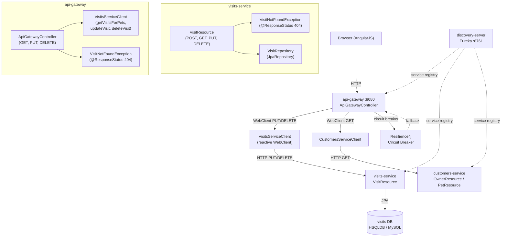
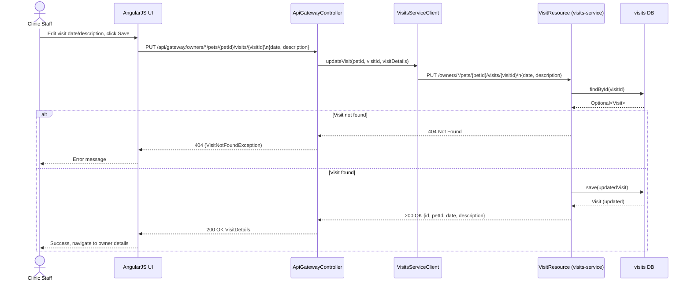
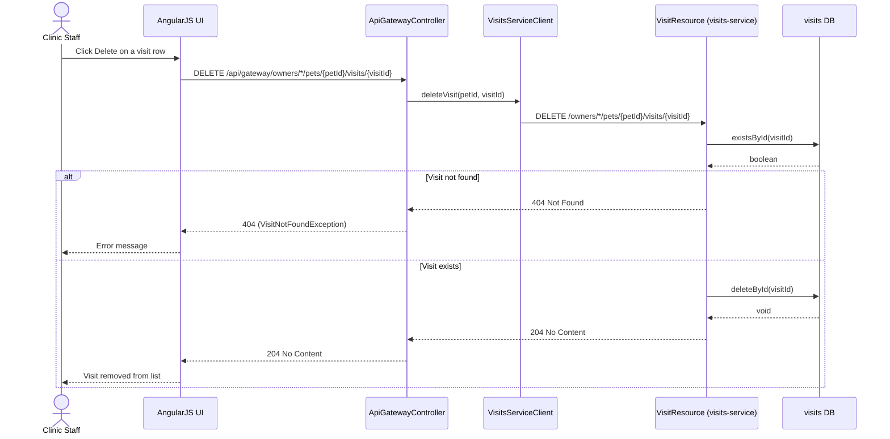
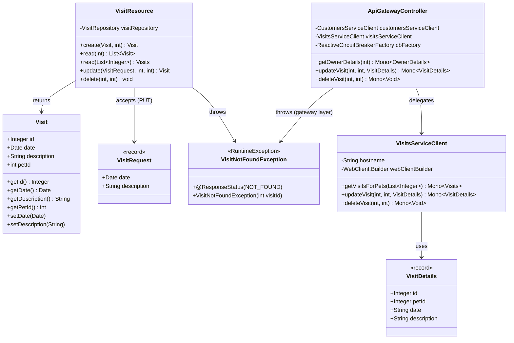
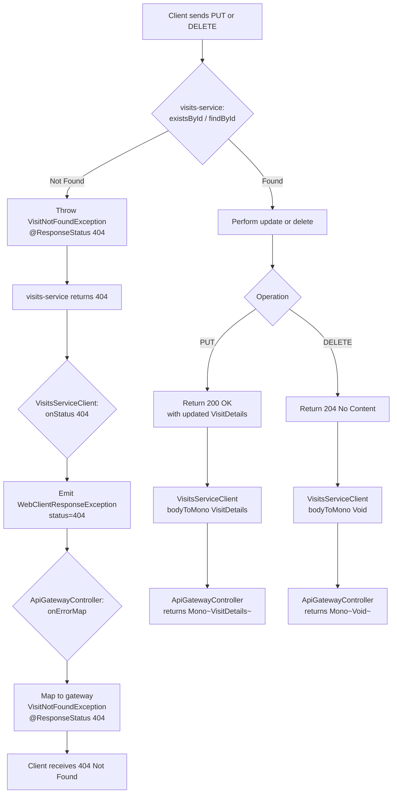

# PRD: Visit Update & Delete Enhancement (PR #149)

This PRD documents the full scope of the enhancement introduced in [spring-petclinic-microservices PR #149](https://github.com/spring-petclinic/spring-petclinic-microservices/pull/149), which adds **PUT (update)** and **DELETE** operations for veterinary visit records across the entire microservices stack. The enhancement closes a long-standing CRUD gap: the `visits-service` previously only supported `POST` (create) and `GET` (read), leaving clinic staff unable to correct or cancel visit records without direct database access.

---

## Design & Architecture

### Overview

The Spring PetClinic Microservices system is a cloud-native, distributed application built on Spring Boot 4.0.1 and Spring Cloud 2025.1.0. It exposes a single AngularJS frontend through an **API Gateway** (port 8080) that routes and aggregates calls to three backend domain services: `customers-service` (owners & pets), `visits-service` (visit records), and `vets-service` (veterinarians). A `genai-service` provides an AI chatbot layer on top.

PR #149 adds full CRUD support for visit records by threading two new operations — **update** (`PUT`) and **delete** (`DELETE`) — through every layer of the stack: the `visits-service` REST controller, the `api-gateway` reactive client and controller, and the AngularJS frontend UI. The implementation follows all existing patterns: `@ResponseStatus`-annotated exception classes for 404 mapping, `VisitRequest` DTO to decouple the API contract from the JPA entity, reactive `Mono<T>` returns in the gateway, and `@WebMvcTest` slice tests with `@MockitoBean`.

The change is purely additive — no existing endpoints, database schema, or entity fields are modified. The `Visit` JPA entity (`id`, `pet_id`, `visit_date`, `description`) is unchanged; only the mutable fields (`date`, `description`) are exposed through the new `VisitRequest` record DTO, preventing clients from overwriting immutable fields like `id` or `petId`.

---

### Diagrams

#### Architecture / Component Diagram



#### Sequence Diagram — Update Visit Flow



#### Sequence Diagram — Delete Visit Flow



#### Class / Data Model Diagram



#### Flowchart — Error Handling & 404 Propagation



---

### Directory Structure

```
spring-petclinic-microservices/
├── spring-petclinic-visits-service/
│   └── src/
│       ├── main/java/.../visits/
│       │   ├── model/
│       │   │   ├── Visit.java                    # JPA entity (unchanged)
│       │   │   └── VisitRepository.java           # JpaRepository (unchanged)
│       │   └── web/
│       │       ├── VisitResource.java             # ★ MODIFIED: +update(), +delete()
│       │       ├── VisitNotFoundException.java    # ★ NEW: @ResponseStatus(404)
│       │       └── (VisitRequest record)          # ★ NEW: inner record in VisitResource
│       └── test/java/.../visits/web/
│           └── VisitResourceTest.java             # ★ MODIFIED: +PUT/DELETE tests
│
├── spring-petclinic-api-gateway/
│   └── src/main/java/.../api/
│       ├── application/
│       │   └── VisitsServiceClient.java           # ★ MODIFIED: +updateVisit(), +deleteVisit()
│       ├── boundary/web/
│       │   ├── ApiGatewayController.java          # ★ MODIFIED: +updateVisit(), +deleteVisit()
│       │   └── VisitNotFoundException.java        # ★ NEW: gateway-layer 404 exception
│       └── dto/
│           └── VisitDetails.java                  # unchanged (id, petId, date, description)
│
└── spring-petclinic-api-gateway/src/main/resources/static/scripts/
    └── visits/
        ├── visits.controller.js                   # ★ MODIFIED: +edit/delete actions
        └── visits.template.html                   # ★ MODIFIED: +Edit/Delete buttons per row
```

---

### Key Design Decisions

| Decision | Choice | Rationale |
|----------|--------|-----------|
| Separate `VisitRequest` DTO for PUT | Inner `record VisitRequest(Date date, String description)` in `VisitResource` | Mirrors `OwnerRequest`/`PetRequest` pattern in `customers-service`; prevents clients from overwriting immutable `id` or `petId` fields |
| 404 exception class per service layer | `VisitNotFoundException` in both `visits-service` and `api-gateway` | Each layer owns its own exception; gateway maps `WebClientResponseException(404)` → its own `VisitNotFoundException` via `onErrorMap` |
| Partial update semantics (PATCH-like PUT) | `null`-check before setting `date`/`description` | Allows callers to update only one field without resetting the other; simpler than implementing true `PATCH` |
| `existsById` for DELETE pre-check | `visitRepository.existsById(visitId)` before `deleteById` | Enables explicit 404 response; `deleteById` on JPA silently no-ops for missing IDs |
| Reactive propagation in gateway | `onErrorMap(WebClientResponseException, ...)` | Keeps the reactive chain clean; maps HTTP-level errors to domain exceptions without blocking |
| No schema changes | Visit entity fields unchanged | Update only touches `date` and `description` — both already present in the `visits` table |
| `@ResponseStatus(NOT_FOUND)` on exception | Annotation-driven HTTP mapping | Consistent with `ResourceNotFoundException` in `customers-service`; no need for `@ExceptionHandler` boilerplate |
| Frontend: inline edit vs. separate page | Inline edit row / navigate to edit form | Follows existing AngularJS `$state.go` navigation pattern used by `VisitsController` |

---

### Technology Stack

- **Runtime/Language:** Java 17, Spring Boot 4.0.1
- **Framework:** Spring MVC (visits-service), Spring WebFlux/Reactor (api-gateway)
- **Service Discovery:** Spring Cloud Eureka (discovery-server :8761)
- **Circuit Breaker:** Resilience4j via `ReactiveCircuitBreakerFactory`
- **Persistence:** Spring Data JPA, HSQLDB (default), MySQL (optional via `mysql` profile)
- **HTTP Client (gateway):** Spring WebClient (reactive)
- **Frontend:** AngularJS 1.x, UI-Router (`$state`, `$stateParams`)
- **Observability:** Micrometer `@Timed("petclinic.visit")`, SLF4J logging
- **Testing:** JUnit 5, `@WebMvcTest`, `@MockitoBean`, MockMvc, BDDMockito
- **Build:** Maven 3, Spring Boot Maven Plugin (`buildDocker` profile)
- **Containerization:** Docker Compose, Zipkin, Prometheus, Grafana

---

## Execution Plan

### Phase 1: visits-service — Update & Delete Endpoints
**Estimated effort:** 2-3 hours
**Dependencies:** None

Implement the two new REST endpoints in `VisitResource.java` and introduce the supporting `VisitNotFoundException` and `VisitRequest` types. This is the core backend change — all other phases depend on it.

#### Tasks:
- [ ] Create `spring-petclinic-visits-service/src/main/java/org/springframework/samples/petclinic/visits/web/VisitNotFoundException.java`
  - Annotate with `@ResponseStatus(value = HttpStatus.NOT_FOUND)`
  - Extend `RuntimeException`
  - Constructor: `VisitNotFoundException(int visitId)` → message `"Visit " + visitId + " not found"`
  - Consistent with `ResourceNotFoundException` in `customers-service`
- [ ] Modify `VisitResource.java` to add inner `record VisitRequest(Date date, String description)`
  - Fields: `Date date` (nullable), `String description` (nullable)
  - No `@NotNull` constraints — allows partial updates
- [ ] Add `PUT owners/*/pets/{petId}/visits/{visitId}` handler `update()` in `VisitResource`:
  - Signature: `public Visit update(@Valid @RequestBody VisitRequest visitRequest, @PathVariable("petId") @Min(1) int petId, @PathVariable("visitId") @Min(1) int visitId)`
  - Call `visitRepository.findById(visitId).orElseThrow(() -> new VisitNotFoundException(visitId))`
  - Null-check before setting: `if (visitRequest.date() != null) visit.setDate(visitRequest.date())`
  - Null-check before setting: `if (visitRequest.description() != null) visit.setDescription(visitRequest.description())`
  - Log: `log.info("Updating visit {}", visit)`
  - Return `visitRepository.save(visit)` with default `200 OK`
- [ ] Add `DELETE owners/*/pets/{petId}/visits/{visitId}` handler `delete()` in `VisitResource`:
  - Annotate with `@ResponseStatus(HttpStatus.NO_CONTENT)`
  - Signature: `public void delete(@PathVariable("petId") @Min(1) int petId, @PathVariable("visitId") @Min(1) int visitId)`
  - Call `visitRepository.existsById(visitId)` — throw `VisitNotFoundException(visitId)` if false
  - Log: `log.info("Deleting visit {}", visitId)`
  - Call `visitRepository.deleteById(visitId)`
- [ ] Verify imports: `@PutMapping`, `@DeleteMapping`, `@PathVariable`, `HttpStatus`, `VisitNotFoundException` all present in `VisitResource.java`
- [ ] Run syntax check: `./mvnw -pl spring-petclinic-visits-service compile -q`

#### Deliverables:
- `spring-petclinic-visits-service/src/main/java/.../visits/web/VisitNotFoundException.java` (new file)
- `spring-petclinic-visits-service/src/main/java/.../visits/web/VisitResource.java` (modified: +`update()`, +`delete()`, +`VisitRequest` record)

---

### Phase 2: api-gateway — VisitsServiceClient Reactive Methods
**Estimated effort:** 2-3 hours
**Dependencies:** None (can develop in parallel with Phase 1)

Extend `VisitsServiceClient` with two new reactive WebClient methods that proxy the new `PUT` and `DELETE` endpoints in `visits-service`. This is the gateway's outbound HTTP client layer.

#### Tasks:
- [ ] Modify `spring-petclinic-api-gateway/src/main/java/.../api/application/VisitsServiceClient.java`
- [ ] Add `updateVisit(int petId, int visitId, VisitDetails visit)` method:
  - Return type: `Mono<VisitDetails>`
  - Use `webClientBuilder.build().put().uri(hostname + "owners/*/pets/{petId}/visits/{visitId}", petId, visitId)`
  - `.bodyValue(visit)`
  - `.retrieve()`
  - `.onStatus(HttpStatus.NOT_FOUND::equals, response -> Mono.error(new WebClientResponseException(HttpStatus.NOT_FOUND.value(), HttpStatus.NOT_FOUND.getReasonPhrase(), response.headers().asHttpHeaders(), null, null)))`
  - `.bodyToMono(VisitDetails.class)`
- [ ] Add `deleteVisit(int petId, int visitId)` method:
  - Return type: `Mono<Void>`
  - Use `webClientBuilder.build().delete().uri(hostname + "owners/*/pets/{petId}/visits/{visitId}", petId, visitId)`
  - `.retrieve()`
  - `.onStatus(HttpStatus.NOT_FOUND::equals, ...)` — same 404 mapping as `updateVisit`
  - `.bodyToMono(Void.class)`
- [ ] Verify imports: `WebClientResponseException`, `HttpStatus`, `VisitDetails`, `Mono` all present
- [ ] Run syntax check: `./mvnw -pl spring-petclinic-api-gateway compile -q`

#### Deliverables:
- `spring-petclinic-api-gateway/src/main/java/.../api/application/VisitsServiceClient.java` (modified: +`updateVisit()`, +`deleteVisit()`)

---

### Phase 3: api-gateway — Controller Endpoints & VisitNotFoundException
**Estimated effort:** 2-3 hours
**Dependencies:** Phase 2

Wire the new `VisitsServiceClient` methods into `ApiGatewayController` and introduce the gateway-layer `VisitNotFoundException` for clean 404 propagation.

#### Tasks:
- [ ] Create `spring-petclinic-api-gateway/src/main/java/.../api/boundary/web/VisitNotFoundException.java`
  - Annotate with `@ResponseStatus(value = HttpStatus.NOT_FOUND)`
  - Extend `RuntimeException`
  - Constructor: `VisitNotFoundException(int visitId)` → message `"Visit not found with id: " + visitId`
- [ ] Modify `ApiGatewayController.java` to add `updateVisit` endpoint:
  - Annotate: `@PutMapping("owners/*/pets/{petId}/visits/{visitId}")`
  - Signature: `public Mono<VisitDetails> updateVisit(@PathVariable("petId") int petId, @PathVariable("visitId") int visitId, @RequestBody VisitDetails visit)`
  - Body: `return visitsServiceClient.updateVisit(petId, visitId, visit).onErrorMap(WebClientResponseException.class, ex -> ex.getStatusCode() == HttpStatus.NOT_FOUND ? new VisitNotFoundException(visitId) : ex)`
- [ ] Modify `ApiGatewayController.java` to add `deleteVisit` endpoint:
  - Annotate: `@DeleteMapping("owners/*/pets/{petId}/visits/{visitId}")` + `@ResponseStatus(HttpStatus.NO_CONTENT)`
  - Signature: `public Mono<Void> deleteVisit(@PathVariable("petId") int petId, @PathVariable("visitId") int visitId)`
  - Body: `return visitsServiceClient.deleteVisit(petId, visitId).onErrorMap(WebClientResponseException.class, ex -> ex.getStatusCode() == HttpStatus.NOT_FOUND ? new VisitNotFoundException(visitId) : ex)`
- [ ] Add required imports: `@PutMapping`, `@DeleteMapping`, `@RequestBody`, `@ResponseStatus`, `HttpStatus`, `WebClientResponseException`, `VisitNotFoundException`
- [ ] Run syntax check: `./mvnw -pl spring-petclinic-api-gateway compile -q`

#### Deliverables:
- `spring-petclinic-api-gateway/src/main/java/.../api/boundary/web/VisitNotFoundException.java` (new file)
- `spring-petclinic-api-gateway/src/main/java/.../api/boundary/web/ApiGatewayController.java` (modified: +`updateVisit()`, +`deleteVisit()`)

---

### Phase 4: Frontend — AngularJS Edit & Delete UI
**Estimated effort:** 3-4 hours
**Dependencies:** None (can develop in parallel with Phases 1-3)

Update the AngularJS visits module to expose Edit and Delete actions in the visit list table. The existing `VisitsController` handles `POST` (create) and `GET` (list); extend it with `PUT` (update) and `DELETE` (delete) operations.

#### Tasks:
- [ ] Modify `spring-petclinic-api-gateway/src/main/resources/static/scripts/visits/visits.controller.js`:
  - Add `self.editingVisit = null` state variable to track which visit row is in edit mode
  - Add `self.startEdit(visit)` function: sets `self.editingVisit = angular.copy(visit)` to clone the visit for editing
  - Add `self.cancelEdit()` function: sets `self.editingVisit = null`
  - Add `self.saveEdit(visit)` function:
    - Constructs `PUT` URL: `"api/visit/owners/" + $stateParams.ownerId + "/pets/" + petId + "/visits/" + visit.id`
    - Sends `$http.put(putUrl, {date: $filter('date')(self.editingVisit.date, "yyyy-MM-dd"), description: self.editingVisit.description})`
    - On success: refresh visit list via `$http.get(url)`, reset `self.editingVisit = null`
    - On error: display error message (e.g., `self.errorMessage = "Visit not found or update failed"`)
  - Add `self.deleteVisit(visit)` function:
    - Constructs `DELETE` URL: `"api/visit/owners/" + $stateParams.ownerId + "/pets/" + petId + "/visits/" + visit.id`
    - Sends `$http.delete(deleteUrl)`
    - On success: remove visit from `self.visits` array using `self.visits.splice(index, 1)` or re-fetch
    - On error: display error message
- [ ] Modify `spring-petclinic-api-gateway/src/main/resources/static/scripts/visits/visits.template.html`:
  - Add "Actions" column header to the `<table>` header row
  - For each visit row (`ng-repeat="v in $ctrl.visits"`):
    - Add conditional display: show static row when `$ctrl.editingVisit === null || $ctrl.editingVisit.id !== v.id`
    - Add "Edit" button: `<button class="btn btn-sm btn-default" ng-click="$ctrl.startEdit(v)">Edit</button>`
    - Add "Delete" button: `<button class="btn btn-sm btn-danger" ng-click="$ctrl.deleteVisit(v)">Delete</button>`
    - Add inline edit row (shown when `$ctrl.editingVisit.id === v.id`):
      - Date input: `<input type="date" ng-model="$ctrl.editingVisit.date" class="form-control input-sm"/>`
      - Description textarea: `<textarea ng-model="$ctrl.editingVisit.description" class="form-control" rows="2"></textarea>`
      - "Save" button: `<button class="btn btn-sm btn-primary" ng-click="$ctrl.saveEdit(v)">Save</button>`
      - "Cancel" button: `<button class="btn btn-sm btn-default" ng-click="$ctrl.cancelEdit()">Cancel</button>`
  - Add error message display: `<div class="alert alert-danger" ng-if="$ctrl.errorMessage">{{$ctrl.errorMessage}}</div>`
- [ ] Verify the `api/visit/` route prefix is consistent with existing `VisitsController` URL construction pattern
- [ ] Check that `$filter` is injected in the controller (already present for date formatting in `submit()`)

#### Deliverables:
- `spring-petclinic-api-gateway/src/main/resources/static/scripts/visits/visits.controller.js` (modified: +`startEdit()`, +`cancelEdit()`, +`saveEdit()`, +`deleteVisit()`)
- `spring-petclinic-api-gateway/src/main/resources/static/scripts/visits/visits.template.html` (modified: +Edit/Delete buttons, +inline edit row, +error display)

---

### Phase 5: Testing & Quality Assurance
**Estimated effort:** 3-4 hours
**Dependencies:** Phase 1, Phase 2, Phase 3

Write and run all unit tests for the new endpoints. Tests follow the existing `@WebMvcTest` + `@MockitoBean` pattern established in `VisitResourceTest.java`.

#### Tasks:
- [ ] Extend `spring-petclinic-visits-service/src/test/java/.../visits/web/VisitResourceTest.java` with:
  - **`shouldUpdateVisit()`**: Mock `visitRepository.findById(42)` → `Optional.of(existingVisit)`, mock `visitRepository.save(any())` → `updatedVisit`; perform `PUT /owners/1/pets/7/visits/42` with JSON `{date: "2001-09-09", description: "Updated description"}`; assert `200 OK`, `$.id == 42`, `$.petId == 7`, `$.description == "Updated description"`; verify `findById(42)` and `save(any())` called
  - **`shouldReturn404WhenUpdatingNonExistentVisit()`**: Mock `visitRepository.findById(999)` → `Optional.empty()`; perform `PUT /owners/1/pets/7/visits/999`; assert `404 Not Found`; verify `save` never called
  - **`shouldReturn404WhenPetIdMismatchOnUpdate()`**: Mock `visitRepository.findById(55)` → `Optional.empty()`; perform `PUT /owners/1/pets/7/visits/55`; assert `404 Not Found`; document that current implementation does NOT validate petId ownership (only visitId existence)
  - **`shouldDeleteVisit()`**: Mock `visitRepository.existsById(42)` → `true`; perform `DELETE /owners/1/pets/7/visits/42`; assert `204 No Content`; verify `existsById(42)` and `deleteById(42)` called
  - **`shouldReturn404WhenDeletingNonExistentVisit()`**: Mock `visitRepository.existsById(999)` → `false`; perform `DELETE /owners/1/pets/7/visits/999`; assert `404 Not Found`; verify `deleteById` never called
- [ ] Run visits-service tests: `./mvnw -pl spring-petclinic-visits-service test`
  - Expected: all 5 tests pass (1 existing `shouldFetchVisits` + 4 new)
- [ ] Run api-gateway tests (if any exist): `./mvnw -pl spring-petclinic-api-gateway test`
- [ ] Run full build to confirm no regressions: `./mvnw clean install -DskipTests=false`
  - Expected: `BUILD SUCCESS` across all modules
- [ ] Verify `VisitNotFoundException` in `visits-service` maps to `404` by checking `@ResponseStatus` annotation is present
- [ ] Verify `VisitNotFoundException` in `api-gateway` maps to `404` by checking `@ResponseStatus` annotation is present

#### Deliverables:
- `spring-petclinic-visits-service/src/test/java/.../visits/web/VisitResourceTest.java` (modified: +4 new test methods)
- All tests passing: `./mvnw clean install` exits with `BUILD SUCCESS`

---

### Phase 6: Documentation
**Estimated effort:** 1 hour
**Dependencies:** Phase 1, Phase 2, Phase 3, Phase 4, Phase 5

Update the project README to document the new visit management API endpoints.

#### Tasks:
- [ ] Update `README.md` to add a section documenting the new visit endpoints:
  - `PUT /api/gateway/owners/*/pets/{petId}/visits/{visitId}` — update visit date/description
  - `DELETE /api/gateway/owners/*/pets/{petId}/visits/{visitId}` — delete a visit
  - Include request/response examples and HTTP status codes (200, 204, 404)
- [ ] Update `.env.example` if any new environment variables were introduced (none expected for this PR)

#### Deliverables:
- `README.md` (modified: +visit CRUD API documentation section)

---

## Verification Criteria

After all phases are complete, verify the enhancement works end-to-end as follows:

### Unit Test Verification
```bash
# Run visits-service tests — expect 5 passing tests
./mvnw -pl spring-petclinic-visits-service test
# Expected output: Tests run: 5, Failures: 0, Errors: 0, Skipped: 0

# Run full build — expect BUILD SUCCESS
./mvnw clean install
# Expected: BUILD SUCCESS
```

### API Endpoint Verification (with services running)
```bash
# 1. Create a visit (existing endpoint — baseline)
curl -s -X POST http://localhost:8080/api/visit/owners/1/pets/1/visits \
  -H "Content-Type: application/json" \
  -d '{"date":"2026-07-09","description":"Annual checkup"}' | jq .
# Expected: {"id": <N>, "petId": 1, "date": "2026-07-09", "description": "Annual checkup"}

# 2. Update the visit (NEW endpoint)
curl -s -X PUT http://localhost:8080/api/gateway/owners/1/pets/1/visits/<N> \
  -H "Content-Type: application/json" \
  -d '{"date":"2026-07-10","description":"Follow-up checkup"}' | jq .
# Expected: 200 OK with {"id": <N>, "petId": 1, "date": "2026-07-10", "description": "Follow-up checkup"}

# 3. Update non-existent visit (404 test)
curl -s -o /dev/null -w "%{http_code}" \
  -X PUT http://localhost:8080/api/gateway/owners/1/pets/1/visits/99999 \
  -H "Content-Type: application/json" \
  -d '{"description":"Should fail"}'
# Expected: 404

# 4. Delete the visit (NEW endpoint)
curl -s -o /dev/null -w "%{http_code}" \
  -X DELETE http://localhost:8080/api/gateway/owners/1/pets/1/visits/<N>
# Expected: 204

# 5. Delete non-existent visit (404 test)
curl -s -o /dev/null -w "%{http_code}" \
  -X DELETE http://localhost:8080/api/gateway/owners/1/pets/1/visits/99999
# Expected: 404

# 6. Verify visit is gone (GET after DELETE)
curl -s http://localhost:8080/api/visit/owners/1/pets/1/visits | jq .
# Expected: visit <N> is NOT in the response array
```

### Frontend Verification
1. Navigate to `http://localhost:8080` in a browser
2. Go to **Find Owners** → select an owner → click on a pet's **Visits** link
3. Verify the visit list table shows **Edit** and **Delete** buttons for each existing visit
4. Click **Edit** on a visit → verify inline edit form appears with current date and description pre-filled
5. Modify the description → click **Save** → verify the visit row updates in place without page reload
6. Click **Delete** on a visit → verify the visit is removed from the list immediately
7. Click **Edit** → click **Cancel** → verify the edit form closes and original data is unchanged

### Regression Verification
- Navigate to owner details page (`/owners/{id}`) — verify existing visit list still displays correctly
- Create a new visit via the existing form — verify `POST` still works and new visit appears in list
- Verify the circuit breaker fallback still works: if `visits-service` is down, owner details page loads with empty visits list (no 500 error)
