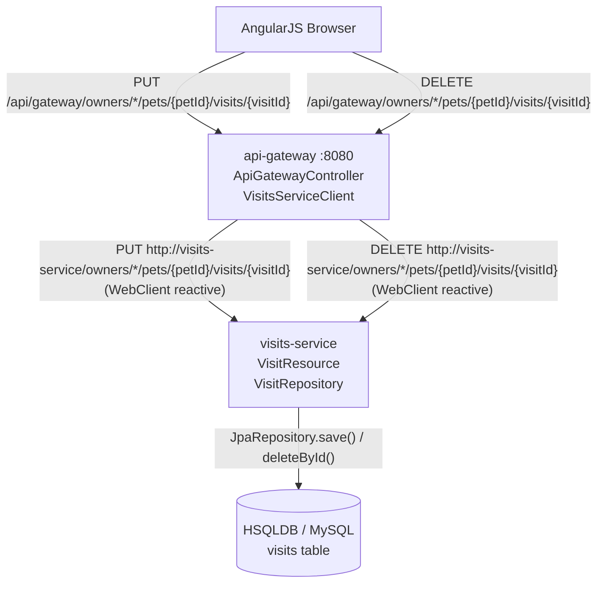
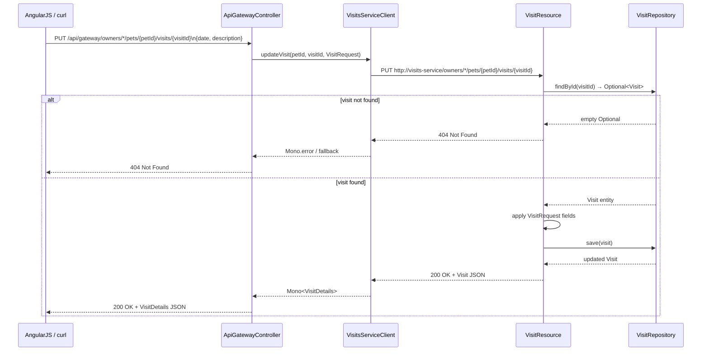
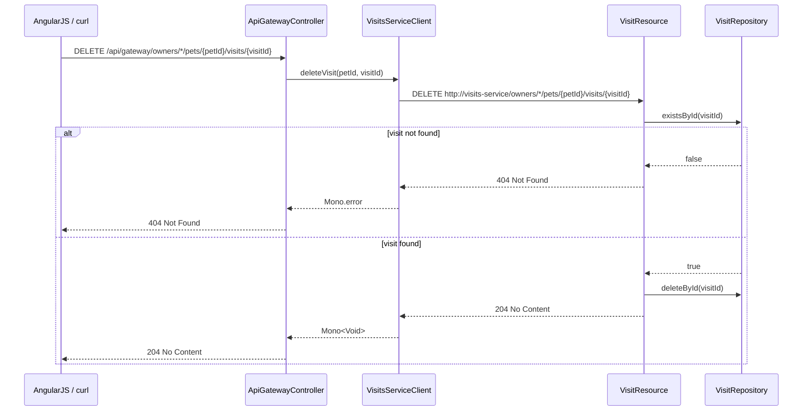
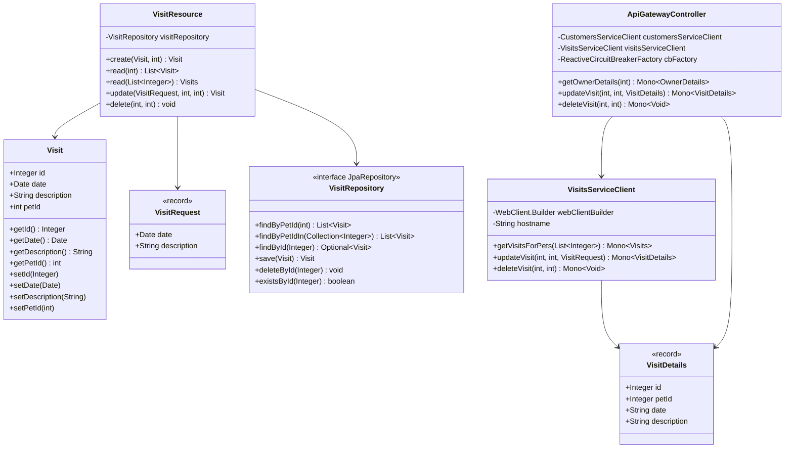
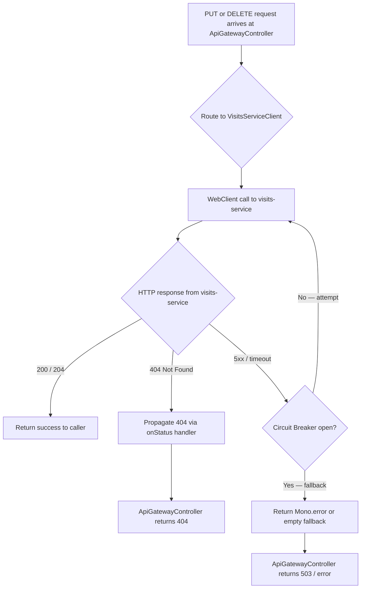

# PRD: Add Update/Delete Visit Endpoints (Issue #507)

This plan implements the missing `PUT` (update) and `DELETE` (delete) REST endpoints for visit records in the Spring PetClinic Microservices project. The changes span two services: `spring-petclinic-visits-service` (the authoritative data owner) and `spring-petclinic-api-gateway` (the reactive aggregation layer that proxies visit mutations to the frontend). No frontend (AngularJS), no GenAI service changes, and no database schema migrations are required — the existing `visits` table schema already supports the full CRUD lifecycle.

---

## Design & Architecture

### Overview

The Spring PetClinic Microservices system exposes visit data through a two-tier API: the `visits-service` owns the JPA entity (`Visit`) and the Spring Data repository (`VisitRepository extends JpaRepository<Visit, Integer>`), while the `api-gateway` aggregates owner + visit data reactively via WebClient and exposes a unified REST surface to the AngularJS frontend. Currently, `VisitResource` in `visits-service` only exposes `POST` (create) and two `GET` (read) endpoints. The `JpaRepository` base interface already provides `save()` and `deleteById()` — no new repository methods are needed.

The implementation adds two new endpoints to `VisitResource`:
- `PUT /owners/*/pets/{petId}/visits/{visitId}` — updates an existing visit's `date` and/or `description`
- `DELETE /owners/*/pets/{petId}/visits/{visitId}` — deletes a visit by ID

The `api-gateway` gains two corresponding reactive proxy methods in `VisitsServiceClient` and two new handler methods in `ApiGatewayController`, following the existing WebClient + Resilience4j circuit-breaker pattern already used for `getOwnerDetails`. A `VisitRequest` DTO record is introduced in `visits-service` to decouple the update payload from the `Visit` JPA entity, consistent with the `OwnerRequest`/`PetRequest` pattern in `customers-service`.

### Diagram 1: Component & Data Flow



### Diagram 2: Sequence — Update Visit



### Diagram 3: Sequence — Delete Visit



### Diagram 4: Class / Data Model



### Diagram 5: Error Handling Flowchart



### Directory Structure

```
spring-petclinic-microservices/
├── spring-petclinic-visits-service/
│   └── src/
│       ├── main/java/org/springframework/samples/petclinic/visits/
│       │   ├── model/
│       │   │   ├── Visit.java                  # JPA entity (unchanged)
│       │   │   └── VisitRepository.java         # JpaRepository (unchanged — save/deleteById inherited)
│       │   └── web/
│       │       ├── VisitResource.java           # ADD: PUT + DELETE handlers + VisitRequest DTO
│       │       └── VisitNotFoundException.java  # NEW: custom 404 exception
│       └── test/java/org/springframework/samples/petclinic/visits/web/
│           └── VisitResourceTest.java           # ADD: tests for update + delete
│
└── spring-petclinic-api-gateway/
    └── src/
        ├── main/java/org/springframework/samples/petclinic/api/
        │   ├── application/
        │   │   └── VisitsServiceClient.java     # ADD: updateVisit() + deleteVisit() methods
        │   └── boundary/web/
        │       └── ApiGatewayController.java    # ADD: PUT + DELETE gateway endpoints
        └── test/java/org/springframework/samples/petclinic/api/
            ├── application/
            │   └── VisitsServiceClientIntegrationTest.java  # ADD: tests for new client methods
            └── boundary/web/
                └── ApiGatewayControllerTest.java            # ADD: tests for new gateway endpoints
```

### Key Design Decisions

| Decision | Choice | Rationale |
|----------|--------|-----------|
| DTO for update payload | New `VisitRequest` record in `visits-service` | Mirrors `OwnerRequest`/`PetRequest` pattern in `customers-service`; decouples API contract from JPA entity; prevents clients from overwriting `id` or `petId` |
| 404 handling in visits-service | New `VisitNotFoundException` with `@ResponseStatus(HttpStatus.NOT_FOUND)` | Consistent with `ResourceNotFoundException` in `customers-service`; avoids leaking JPA internals |
| DELETE response code | `204 No Content` | REST convention for successful delete with no body |
| PUT response code | `200 OK` with updated `Visit` body | Consistent with existing `POST` returning the saved entity |
| Gateway proxy pattern | New methods on `VisitsServiceClient` + `ApiGatewayController` | Follows existing `getVisitsForPets` / `getOwnerDetails` pattern; keeps WebClient usage centralised in `VisitsServiceClient` |
| Circuit breaker on gateway mutations | Not applied to PUT/DELETE (only GET aggregation uses CB) | Mutations should fail fast and surface errors; silent fallback on a write is dangerous |
| No schema changes | Existing `visits` table schema is sufficient | `id`, `pet_id`, `visit_date`, `description` cover all update fields; no new columns needed |
| Test scope | `@WebMvcTest` slice tests for visits-service; `@WebFluxTest` slice tests for api-gateway | Matches existing test patterns; unit/slice tests only per confirmed requirements |

### Technology Stack

- **Runtime/Language:** Java 17
- **Framework:** Spring Boot 4.0.1, Spring Cloud 2025.1.0
- **visits-service:** Spring MVC (`@RestController`), Spring Data JPA, HSQLDB (default) / MySQL
- **api-gateway:** Spring WebFlux (`@RestController` + `WebClient`), Resilience4j Reactive Circuit Breaker
- **Testing:** JUnit 5, Mockito (`@MockitoBean`), MockMvc (`@WebMvcTest`), WebTestClient (`@WebFluxTest`), MockWebServer (OkHttp3) for `VisitsServiceClientIntegrationTest`
- **Observability:** Micrometer `@Timed("petclinic.visit")` already on `VisitResource` class — new endpoints inherit it automatically

---

## Execution Plan

### Phase 1: visits-service — Update & Delete Endpoints
**Estimated effort:** 2-3 hours
**Dependencies:** None

Add `PUT` and `DELETE` REST endpoints to `VisitResource` in `spring-petclinic-visits-service`. Introduce a `VisitRequest` record DTO for the update payload and a `VisitNotFoundException` for 404 responses. No changes to `VisitRepository` or `Visit` entity are needed — `JpaRepository` already provides `findById`, `save`, and `deleteById`.

#### Tasks:

- [ ] **Create `VisitNotFoundException`** at `spring-petclinic-visits-service/src/main/java/org/springframework/samples/petclinic/visits/web/VisitNotFoundException.java`
  - Annotate with `@ResponseStatus(HttpStatus.NOT_FOUND)`
  - Extend `RuntimeException`
  - Constructor: `VisitNotFoundException(int visitId)` with message `"Visit " + visitId + " not found"`

- [ ] **Add `VisitRequest` record** inside `VisitResource.java` (as a package-level or inner record, consistent with the existing `Visits` inner record pattern)
  - Fields: `@JsonFormat(pattern="yyyy-MM-dd") Date date`, `@Size(max=8192) String description`
  - This decouples the update payload from the `Visit` JPA entity

- [ ] **Add `update()` handler** to `VisitResource`:
  ```
  @PutMapping("owners/*/pets/{petId}/visits/{visitId}")
  @ResponseStatus(HttpStatus.OK)
  public Visit update(
      @Valid @RequestBody VisitRequest visitRequest,
      @PathVariable("petId") @Min(1) int petId,
      @PathVariable("visitId") @Min(1) int visitId)
  ```
  - Call `visitRepository.findById(visitId).orElseThrow(() -> new VisitNotFoundException(visitId))`
  - Apply `visitRequest.date()` and `visitRequest.description()` to the found entity
  - Verify `visit.getPetId() == petId`; if mismatch throw `VisitNotFoundException` (prevents cross-pet tampering)
  - Call `visitRepository.save(visit)` and return the saved entity
  - Add `log.info("Updating visit {}", visitId)` consistent with existing log style

- [ ] **Add `delete()` handler** to `VisitResource`:
  ```
  @DeleteMapping("owners/*/pets/{petId}/visits/{visitId}")
  @ResponseStatus(HttpStatus.NO_CONTENT)
  public void delete(
      @PathVariable("petId") @Min(1) int petId,
      @PathVariable("visitId") @Min(1) int visitId)
  ```
  - Call `visitRepository.findById(visitId).orElseThrow(() -> new VisitNotFoundException(visitId))`
  - Verify `visit.getPetId() == petId` before deleting
  - Call `visitRepository.deleteById(visitId)`
  - Add `log.info("Deleting visit {}", visitId)`

- [ ] **Add missing imports** to `VisitResource.java`:
  - `import org.springframework.web.bind.annotation.PutMapping;`
  - `import org.springframework.web.bind.annotation.DeleteMapping;`
  - `import com.fasterxml.jackson.annotation.JsonFormat;`
  - `import java.util.Date;`

#### Deliverables:
- `spring-petclinic-visits-service/src/main/java/org/springframework/samples/petclinic/visits/web/VisitNotFoundException.java` (new file)
- `spring-petclinic-visits-service/src/main/java/org/springframework/samples/petclinic/visits/web/VisitResource.java` (modified — adds `VisitRequest` record, `update()`, `delete()` methods)

---

### Phase 2: api-gateway — Proxy Update & Delete Endpoints
**Estimated effort:** 2-3 hours
**Dependencies:** None

Extend `VisitsServiceClient` with reactive `updateVisit()` and `deleteVisit()` methods, then expose them through two new handler methods in `ApiGatewayController`. Follow the existing WebClient pattern used by `getVisitsForPets()`. No circuit breaker wrapping on mutations (fail-fast is correct for writes).

#### Tasks:

- [ ] **Add `updateVisit()` to `VisitsServiceClient`**:
  ```java
  public Mono<VisitDetails> updateVisit(int petId, int visitId, VisitDetails visitDetails) {
      return webClientBuilder.build()
          .put()
          .uri(hostname + "owners/*/pets/{petId}/visits/{visitId}", petId, visitId)
          .bodyValue(visitDetails)
          .retrieve()
          .onStatus(HttpStatusCode::is4xxClientError, resp -> Mono.error(new VisitNotFoundException(visitId)))
          .bodyToMono(VisitDetails.class);
  }
  ```
  - Import `org.springframework.http.HttpStatusCode`
  - The `VisitDetails` record (already in `api.dto`) is used as both request and response body — it contains `id`, `petId`, `date`, `description`

- [ ] **Add `deleteVisit()` to `VisitsServiceClient`**:
  ```java
  public Mono<Void> deleteVisit(int petId, int visitId) {
      return webClientBuilder.build()
          .delete()
          .uri(hostname + "owners/*/pets/{petId}/visits/{visitId}", petId, visitId)
          .retrieve()
          .onStatus(HttpStatusCode::is4xxClientError, resp -> Mono.error(new VisitNotFoundException(visitId)))
          .bodyToMono(Void.class);
  }
  ```

- [ ] **Create `VisitNotFoundException`** in the api-gateway module at `spring-petclinic-api-gateway/src/main/java/org/springframework/samples/petclinic/api/boundary/web/VisitNotFoundException.java`
  - Annotate with `@ResponseStatus(HttpStatus.NOT_FOUND)`
  - Constructor: `VisitNotFoundException(int visitId)`

- [ ] **Add `updateVisit()` handler to `ApiGatewayController`**:
  ```java
  @PutMapping(value = "owners/{ownerId}/pets/{petId}/visits/{visitId}")
  public Mono<VisitDetails> updateVisit(
      @PathVariable int ownerId,
      @PathVariable int petId,
      @PathVariable int visitId,
      @RequestBody VisitDetails visitDetails) {
      return visitsServiceClient.updateVisit(petId, visitId, visitDetails);
  }
  ```
  - Note: `ownerId` is accepted for URL consistency but not forwarded (visits-service uses wildcard `owners/*`)

- [ ] **Add `deleteVisit()` handler to `ApiGatewayController`**:
  ```java
  @DeleteMapping(value = "owners/{ownerId}/pets/{petId}/visits/{visitId}")
  @ResponseStatus(HttpStatus.NO_CONTENT)
  public Mono<Void> deleteVisit(
      @PathVariable int ownerId,
      @PathVariable int petId,
      @PathVariable int visitId) {
      return visitsServiceClient.deleteVisit(petId, visitId);
  }
  ```

- [ ] **Add missing imports** to `ApiGatewayController.java`:
  - `import org.springframework.web.bind.annotation.PutMapping;`
  - `import org.springframework.web.bind.annotation.DeleteMapping;`
  - `import org.springframework.web.bind.annotation.RequestBody;`
  - `import org.springframework.http.HttpStatus;`
  - `import org.springframework.web.bind.annotation.ResponseStatus;`
  - `import org.springframework.samples.petclinic.api.dto.VisitDetails;`

#### Deliverables:
- `spring-petclinic-api-gateway/src/main/java/org/springframework/samples/petclinic/api/application/VisitsServiceClient.java` (modified — adds `updateVisit()`, `deleteVisit()`)
- `spring-petclinic-api-gateway/src/main/java/org/springframework/samples/petclinic/api/boundary/web/ApiGatewayController.java` (modified — adds `updateVisit()`, `deleteVisit()`)
- `spring-petclinic-api-gateway/src/main/java/org/springframework/samples/petclinic/api/boundary/web/VisitNotFoundException.java` (new file)

---

### Phase 3: Testing — visits-service Slice Tests
**Estimated effort:** 2-3 hours
**Dependencies:** Phase 1

Extend `VisitResourceTest` with `@WebMvcTest` slice tests for the new `update` and `delete` endpoints. Follow the exact pattern of the existing `shouldFetchVisits()` test: use `@MockitoBean VisitRepository`, `MockMvc`, and `BDDMockito.given()`.

#### Tasks:

- [ ] **Add `shouldUpdateVisit()` test** to `VisitResourceTest`:
  - Mock `visitRepository.findById(1)` to return a `Visit` built with `VisitBuilder.aVisit().id(1).petId(7).description("old desc").build()`
  - Mock `visitRepository.save(any())` to return the updated visit
  - Perform `MockMvcRequestBuilders.put("/owners/1/pets/7/visits/1")` with JSON body `{"date":"2024-06-01","description":"updated desc"}`
  - Assert `status().isOk()`
  - Assert `jsonPath("$.description").value("updated desc")`
  - Assert `jsonPath("$.petId").value(7)`

- [ ] **Add `shouldReturn404WhenUpdatingNonExistentVisit()` test**:
  - Mock `visitRepository.findById(999)` to return `Optional.empty()`
  - Perform `put("/owners/1/pets/7/visits/999")` with valid JSON body
  - Assert `status().isNotFound()`

- [ ] **Add `shouldDeleteVisit()` test**:
  - Mock `visitRepository.findById(1)` to return a valid `Visit` with `petId=7`
  - Mock `visitRepository.deleteById(1)` (void, no return needed)
  - Perform `MockMvcRequestBuilders.delete("/owners/1/pets/7/visits/1")`
  - Assert `status().isNoContent()`
  - Verify `visitRepository.deleteById(1)` was called once via `Mockito.verify()`

- [ ] **Add `shouldReturn404WhenDeletingNonExistentVisit()` test**:
  - Mock `visitRepository.findById(999)` to return `Optional.empty()`
  - Perform `delete("/owners/1/pets/7/visits/999")`
  - Assert `status().isNotFound()`

- [ ] **Add `shouldReturn404WhenPetIdMismatchOnUpdate()` test**:
  - Mock `visitRepository.findById(1)` to return a `Visit` with `petId=7`
  - Perform `put("/owners/1/pets/99/visits/1")` (petId 99 ≠ stored petId 7)
  - Assert `status().isNotFound()`

- [ ] **Add required imports** to `VisitResourceTest`:
  - `import org.springframework.http.MediaType;`
  - `import static org.springframework.test.web.servlet.request.MockMvcRequestBuilders.put;`
  - `import static org.springframework.test.web.servlet.request.MockMvcRequestBuilders.delete;`
  - `import static org.mockito.ArgumentMatchers.any;`
  - `import static org.mockito.Mockito.verify;`
  - `import java.util.Optional;`

#### Deliverables:
- `spring-petclinic-visits-service/src/test/java/org/springframework/samples/petclinic/visits/web/VisitResourceTest.java` (modified — 5 new test methods added)

---

### Phase 4: Testing — api-gateway Slice Tests
**Estimated effort:** 2-3 hours
**Dependencies:** Phase 2

Extend `ApiGatewayControllerTest` (`@WebFluxTest`) and `VisitsServiceClientIntegrationTest` (MockWebServer) with tests for the new gateway proxy endpoints.

#### Tasks:

- [ ] **Add `updateVisit_withAvailableVisitsService()` test** to `ApiGatewayControllerTest`:
  - Mock `visitsServiceClient.updateVisit(20, 300, any())` to return `Mono.just(new VisitDetails(300, 20, "2024-06-01", "updated desc"))`
  - Perform `client.put().uri("/api/gateway/owners/1/pets/20/visits/300").bodyValue(visitDetailsJson)`
  - Assert `status().isOk()`
  - Assert `jsonPath("$.description").isEqualTo("updated desc")`

- [ ] **Add `updateVisit_withServiceError()` test** to `ApiGatewayControllerTest`:
  - Mock `visitsServiceClient.updateVisit(20, 999, any())` to return `Mono.error(new VisitNotFoundException(999))`
  - Assert `status().isNotFound()`

- [ ] **Add `deleteVisit_withAvailableVisitsService()` test** to `ApiGatewayControllerTest`:
  - Mock `visitsServiceClient.deleteVisit(20, 300)` to return `Mono.empty()`
  - Perform `client.delete().uri("/api/gateway/owners/1/pets/20/visits/300")`
  - Assert `status().isNoContent()`

- [ ] **Add `deleteVisit_withServiceError()` test** to `ApiGatewayControllerTest`:
  - Mock `visitsServiceClient.deleteVisit(20, 999)` to return `Mono.error(new VisitNotFoundException(999))`
  - Assert `status().isNotFound()`

- [ ] **Add `updateVisit_withAvailableVisitsService()` test** to `VisitsServiceClientIntegrationTest`:
  - Enqueue a `MockResponse` with status 200 and body `{"id":5,"petId":1,"date":"2024-06-01","description":"updated visit"}`
  - Call `visitsServiceClient.updateVisit(1, 5, new VisitDetails(5, 1, "2024-06-01", "updated visit")).block()`
  - Assert description equals `"updated visit"`

- [ ] **Add `deleteVisit_withAvailableVisitsService()` test** to `VisitsServiceClientIntegrationTest`:
  - Enqueue a `MockResponse` with status 204 and empty body
  - Call `visitsServiceClient.deleteVisit(1, 5).block()`
  - Assert no exception is thrown (verify `server.takeRequest()` path matches expected URI)

- [ ] **Add required imports** to both test files:
  - `import org.springframework.web.bind.annotation.ResponseStatus;`
  - `import org.springframework.http.HttpStatus;`
  - `import static org.mockito.ArgumentMatchers.any;`

#### Deliverables:
- `spring-petclinic-api-gateway/src/test/java/org/springframework/samples/petclinic/api/boundary/web/ApiGatewayControllerTest.java` (modified — 4 new test methods)
- `spring-petclinic-api-gateway/src/test/java/org/springframework/samples/petclinic/api/application/VisitsServiceClientIntegrationTest.java` (modified — 2 new test methods)

---

## Verification Criteria

After all phases are complete, verify the implementation as follows:

### Build Verification
```bash
# From workspace root — must compile with zero errors
./mvnw clean compile -pl spring-petclinic-visits-service,spring-petclinic-api-gateway

# Run all tests in both services — all must pass
./mvnw test -pl spring-petclinic-visits-service
./mvnw test -pl spring-petclinic-api-gateway
```

**Expected:** Zero compilation errors. All existing tests continue to pass. New tests pass:
- `VisitResourceTest` — 5 new test methods all GREEN
- `ApiGatewayControllerTest` — 4 new test methods all GREEN
- `VisitsServiceClientIntegrationTest` — 2 new test methods all GREEN

### Manual API Verification (visits-service running standalone)
```bash
# 1. Create a visit (existing endpoint — baseline)
curl -s -X POST http://localhost:8080/owners/1/pets/7/visits \
  -H "Content-Type: application/json" \
  -d '{"date":"2024-06-01","description":"Annual checkup"}' | jq .
# Expected: 201 Created, JSON with id, petId=7, description="Annual checkup"

# 2. Update the visit (NEW endpoint)
curl -s -X PUT http://localhost:8080/owners/1/pets/7/visits/1 \
  -H "Content-Type: application/json" \
  -d '{"date":"2024-06-15","description":"Follow-up checkup"}' | jq .
# Expected: 200 OK, JSON with id=1, petId=7, description="Follow-up checkup"

# 3. Update non-existent visit (NEW — error case)
curl -s -o /dev/null -w "%{http_code}" \
  -X PUT http://localhost:8080/owners/1/pets/7/visits/9999 \
  -H "Content-Type: application/json" \
  -d '{"date":"2024-06-15","description":"Ghost visit"}'
# Expected: 404

# 4. Delete the visit (NEW endpoint)
curl -s -o /dev/null -w "%{http_code}" \
  -X DELETE http://localhost:8080/owners/1/pets/7/visits/1
# Expected: 204

# 5. Confirm deletion
curl -s http://localhost:8080/owners/1/pets/7/visits | jq .
# Expected: 200 OK, empty array [] (visit 1 no longer present)

# 6. Delete non-existent visit (NEW — error case)
curl -s -o /dev/null -w "%{http_code}" \
  -X DELETE http://localhost:8080/owners/1/pets/7/visits/9999
# Expected: 404
```

### Gateway API Verification (full stack running via docker-compose)
```bash
# Update a visit through the gateway
curl -s -X PUT http://localhost:8080/api/gateway/owners/1/pets/7/visits/1 \
  -H "Content-Type: application/json" \
  -d '{"id":1,"petId":7,"date":"2024-06-15","description":"Gateway updated"}' | jq .
# Expected: 200 OK, VisitDetails JSON

# Delete a visit through the gateway
curl -s -o /dev/null -w "%{http_code}" \
  -X DELETE http://localhost:8080/api/gateway/owners/1/pets/7/visits/1
# Expected: 204
```

### Regression Check
```bash
# Existing GET endpoints must still work
curl -s http://localhost:8080/owners/1/pets/7/visits | jq .
# Expected: 200 OK, array of visits

curl -s "http://localhost:8080/pets/visits?petId=7,8" | jq .
# Expected: 200 OK, {"items":[...]}
```
